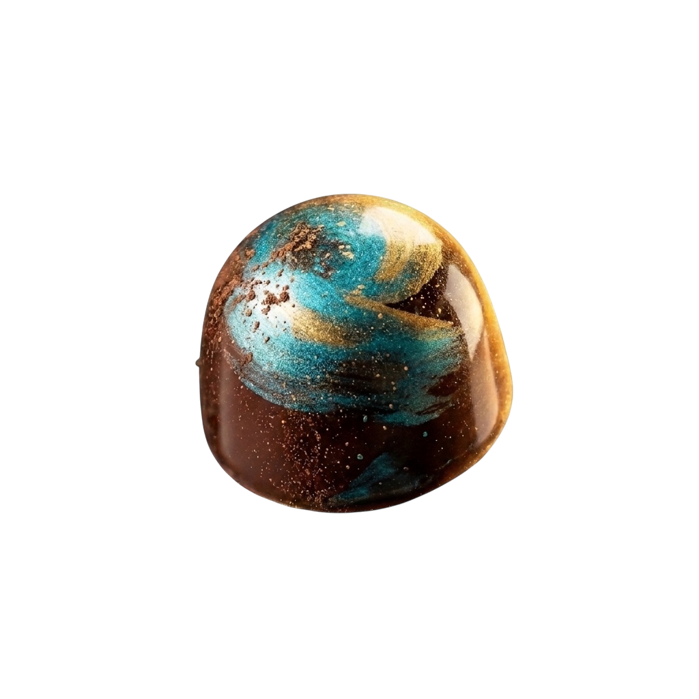

# Ketóret · Chocolatería Artesanal Colombiana 🍫✨

> Plataforma web de lujo y catálogo interactivo para **Ketóret**, chocolatería fina artesanal elaborada con cacao fino de aroma 100% colombiano de origen ético.



---

## 🌟 Características Principales

- **Hero Central de Lujo**:
  - Escenario interactivo con el bombón artesanal marmolado insignia.
  - Habas de cacao dorado 24K y hojuelas de oro flotantes en suspensión con física CSS y profundidad de campo.
  - Iluminación ambiental radial en tonos oro champán (`#E2BD82`) y azul medianoche profundo (`#050811`).
- **Navegación & Identidad Visual**:
  - Barra superior (*Announcement bar*) con beneficios clave (hecho a mano, tarjeta manuscrita, soporte WhatsApp).
  - Menú de cristal (*Glassmorphism*) con selector de categorías, buscador y acceso a cuenta.
  - Tipografías prémium: **Cormorant Garamond** (alta costura/lujo) y **Montserrat** (legibilidad moderna).
- **Catálogo Interactivo con Filtros**:
  - Filtrado por categorías en tiempo real: *Todos*, *Bombones de Autor*, *Barras de Origen*, *Cajas de Regalo* y *Ediciones Limitadas*.
  - Vista previa de fichas técnicas con notas de cata sensoriales (cítricas, florales, frutos secos, 70% cacao araucano, etc.).
- **Carrito de Compras & Checkout Directo por WhatsApp**:
  - Drawer lateral de carrito de compras intuitivo con cálculo dinámico de subtotal.
  - Integración directa con WhatsApp Business (+57 300 143 9633) con codificación automática de pedido formateado.
- **Secciones Estratégicas B2B y Corporativas**:
  - Módulo para regalos corporativos personalizados y eventos con formulario de cotización.
  - Reseñas verificadas con calificación 5.0 ⭐ en Google Reviews.
  - Sección de historia y trazabilidad del cacao campesino colombiano.
- **Modales Integrados**:
  - Buscador predictivo en vivo.
  - Modal de Inicio de Sesión / Registro para clientes frecuentes.
  - Modal de Contacto y Asesoría personalizada.
  - Visor detallado de producto con ingredientes y maridaje.

---

## 🚀 Tecnologías Utilizadas

- **Vite**: Entorno de desarrollo rápido y empaquetador ultraligero.
- **HTML5 Semántico**: Optimizado con etiquetas meta para SEO y accesibilidad.
- **Tailwind CSS & Vanilla CSS**: Sistema de diseño con variables personalizadas, animaciones por fotogramas clave (`keyframes`), y efectos de resplandor.
- **JavaScript Moderno (ES6+)**: Lógica reactiva para estado de carrito, filtrado en vivo, manejo de modales con teclado (`Escape`) y transiciones fluidas.

---

## 💻 Instalación y Uso Local

1. **Clonar el repositorio**:
   ```bash
   git clone https://github.com/kevingaitan10r/ketoret.git
   cd ketoret
   ```

2. **Instalar dependencias**:
   ```bash
   npm install
   ```

3. **Iniciar el servidor de desarrollo**:
   ```bash
   npm run dev
   ```
   Abre tu navegador en `http://localhost:5173/`.

4. **Compilar para producción**:
   ```bash
   npm run build
   ```
   Los archivos optimizados y minificados se generarán en la carpeta `dist/`.

5. **Previsualizar la compilación**:
   ```bash
   npm run preview
   ```

---

## 📁 Estructura del Proyecto

```text
ketoret/
├── public/                  # Activos estáticos (bombón insignia, habas de oro, hojuelas, favicons)
│   ├── bonbon-hero.png
│   ├── golden-bean-1.png
│   ├── golden-bean-2.png
│   ├── golden-bean-3.png
│   ├── golden-bean-blur.png
│   ├── gold-flake-1.png
│   ├── gold-flake-2.png
│   └── favicon.svg
├── src/
│   ├── data/                # Datos de productos, colecciones y notas de cata
│   ├── style.css            # Estilos personalizados, animaciones y tipografías
│   └── main.js              # Lógica interactiva, filtros, carrito y WhatsApp checkout
├── index.html               # Estructura principal de la aplicación web
├── package.json             # Scripts y dependencias
└── README.md                # Documentación del proyecto
```

---

## 🇨🇴 Origen

Diseñado con pasión para resaltar la excelencia del **Cacao Fino de Aroma Colombiano** y la alta chocolatería artesanal.
